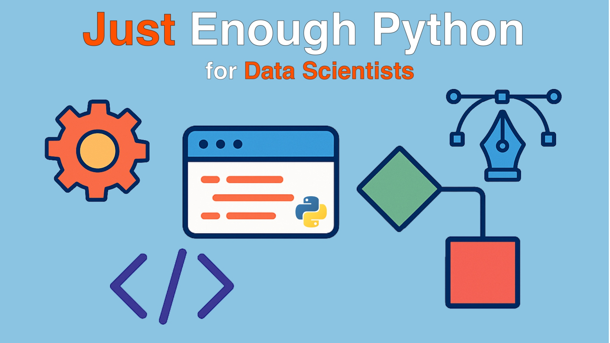

# My personal course repository, forked from Talk Python Training

# Just Enough Python for Data Science Course

Student materials for our Just Enough Python for Data Science course

Data scientists get things done in notebooks, but production-quality work needs more than ad-hoc scripts. **Just Enough Python for Data Scientists** gives you the essential Python and software engineering habits to level up your analyses without drowning in theory. In a few focused hours, you’ll tighten up your core Python, write clean and reusable functions, organize code into importable packages, track work with git and GitHub, debug confidently, and make your results reproducible with pinned environments and Docker. You’ll also see how modern agentic AI tools can accelerate refactoring, documentation, and test creation. The outcome is simple: you keep your notebook speed while gaining the reliability, collaboration, and professionalism your projects deserve.

## What’s this course about and how is it different?

This is a practical, code-first course that teaches the Python you actually need for data work, plus the engineering practices that make your work repeatable and sharable. It is not a survey of every Python feature or a whirlwind tour of ML. You’ll build and run real code, improve existing notebooks, and package useful utilities so teammates can `uv pip install` them.

**Why it stands out:**

- Interactive, live demos in notebooks and editors, not slideware
- Opinionated best practices you can adopt today: ruff, git, uv, Docker, and more
- Reusable patterns: functions, generators for streaming data, package structure
- Reproducibility from the start: pinned deps, locked environments, containers
- A taste of agentic AI to speed up refactors, tests, and docs

## What topics are covered

By the end of this course, you’ll be able to:

- Use core Python types effectively for data tasks (lists, dicts, sets, slicing)
- Control program flow cleanly with `if` and `for`, and write concise loops
- Read and write files safely with context managers (`with open(...)`)
- Write clean, idiomatic Python that teammates understand quickly
- Apply ruff to standardize code style and reduce review friction
- Refactor messy cells into readable modules and functions
- Design functions with clear inputs/outputs and lightweight type hints
- Stream large datasets with generators to avoid out-of-memory crashes
- Organize code into modules and packages with a simple, sensible layout
- Build wheels and publish internal utilities to PyPI (or a private index)
- Manage versions and collaboration with git: clone, branch, commit, and sync
- Handle Jupyter-friendly git workflows and diffs for notebooks
- Debug in JupyterLab and IDEs using breakpoints, watches, and stepping
- Pin, lock, and reproduce environments using uv and `requirements.txt`
- Containerize analyses with Docker for consistent results across machines
- Work productively in notebooks and an IDE side by side (JupyterLab, VS Code, PyCharm)
- Leverage agentic AI tools (e.g., Cursor and Junie) to generate tests, refactor code, and document faster
- Write quick unit tests with pytest to protect fixes and refactors
- Move from prototype to production-friendly code without losing speed

## Take the course at Talk Python

Take the course over at **[training.talkpython.fm/courses/just-enough-python-for-data-scientists](https://training.talkpython.fm/courses/just-enough-python-for-data-scientists)**.

